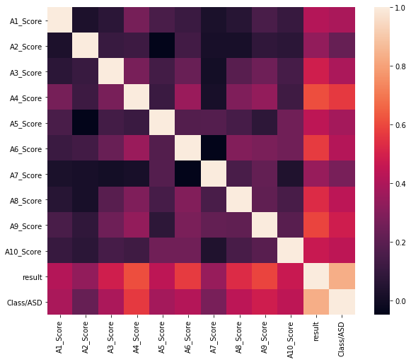

# Análises Dataset ASD

+ [Distribuição Class/ASD vs Results](plot_asd_vs_results.html)
  Este gráfico demonstra a altíssima correlação entre a variável
  resposta e a pontuação nos teste comportamental.
+ [Distribuição Região vs Class/ASD](region-chart.html)
  Este gráfico demonstra a distribuição dos 5 países com maior índice de autistas na amostra analisada.
+ [Distribuição Sexo vs Class/ASD](gender-chart.html)
  Este gráfico demonstra a distribuição de sexo dos autistas.
+ [Distribuição das Crianças em Função da Pontuação no
  Teste](distrib_em_funcao_da_pontuacao.html)
+ [Relação de autismo sobre parantesco](heranca_genetica.html)
+ [Relação de autismo por sexo](plot_diagnost_por_sexo.html)
+ [Relação países com maior incidência de
  autismo](plot_paises_maior_incidencia.html)
+ [Relação paises com mais participantes na
  amostra](plot_paises_mais_participantes.html)
+ [Proporção de sexo na amostra](plot_prop_sexo.html)

# Matriz de Correlação

